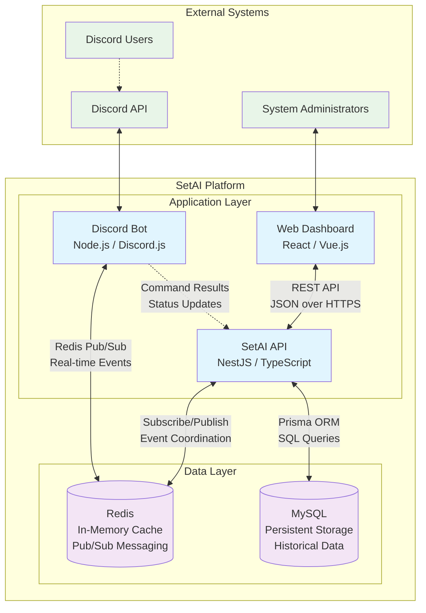
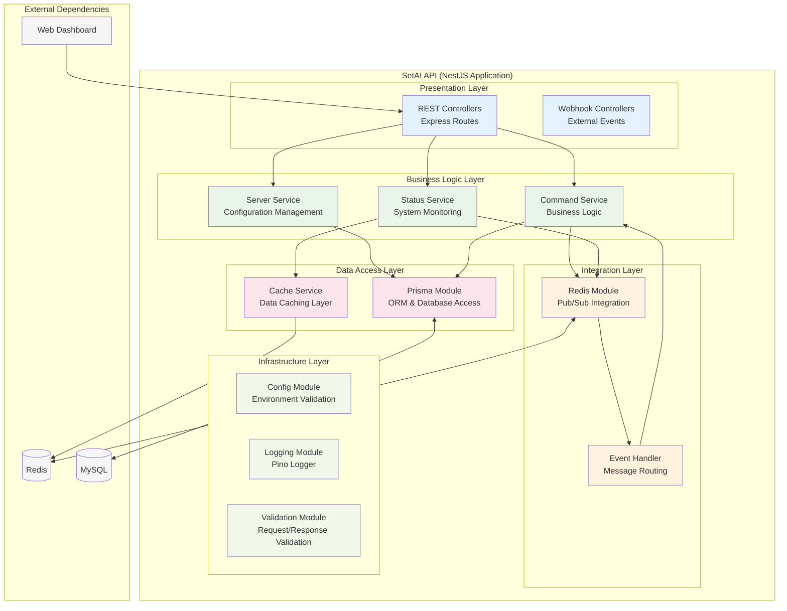
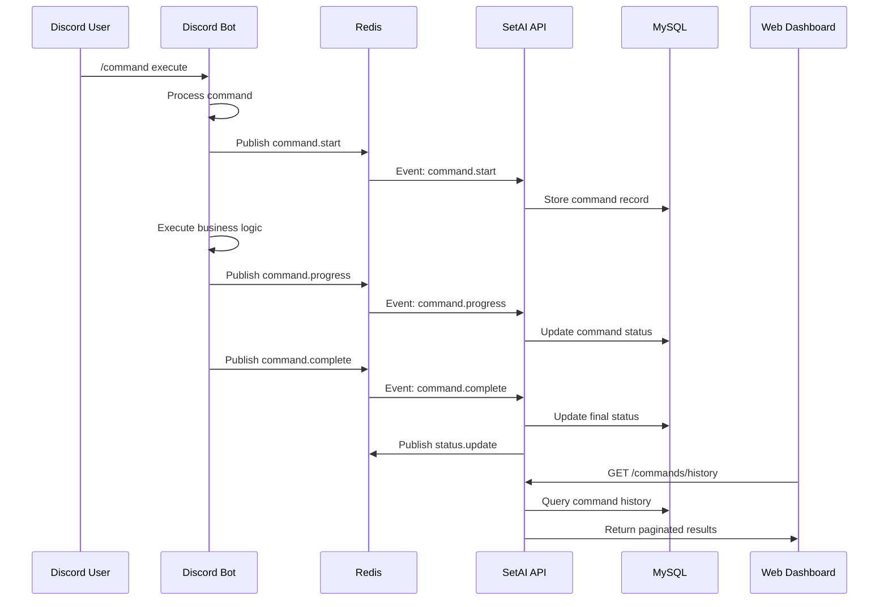
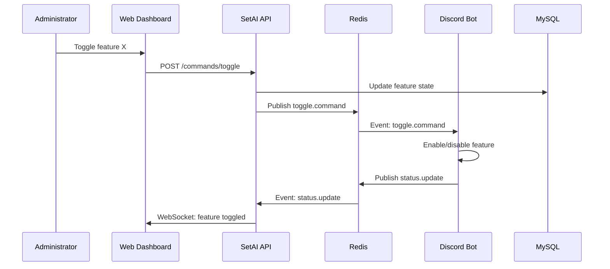

# SetAI API - Architecture Documentation

This document provides detailed architectural documentation for the SetAI API, following the C4 model for software architecture.

## Table of Contents
- [System Context (C4 Level 1)](#system-context-c4-level-1)
- [Container Diagram (C4 Level 2)](#container-diagram-c4-level-2)  
- [Component Diagram (C4 Level 3)](#component-diagram-c4-level-3)
- [Execution Flows](#execution-flows)
- [Data Models](#data-models)
- [Integration Patterns](#integration-patterns)

## System Context (C4 Level 1)

The SetAI system is a Discord bot management platform consisting of multiple interconnected services.

```mermaid
graph TB
    User[Discord Users]
    Admin[System Administrators]
    
    User --> Bot[SetAI Discord Bot]
    Admin --> Web[Web Dashboard]
    
    Bot <--> API[SetAI API<br/>Control & Observability Layer]
    Web <--> API
    
    API --> Redis[(Redis<br/>Pub/Sub & Cache)]
    API --> MySQL[(MySQL<br/>Persistent Storage)]
    
    subgraph "SetAI Ecosystem"
        Bot
        API
        Web
        Redis
        MySQL
    end
    
    classDef primary fill:#e1f5fe
    classDef storage fill:#f3e5f5
    classDef external fill:#e8f5e8
    
    class API primary
    class Redis,MySQL storage  
    class User,Admin external
```

### Key Actors
- **Discord Users**: End users interacting with the bot through Discord commands
- **System Administrators**: Users managing the system through the web dashboard

### System Responsibilities
- **SetAI API**: Central control plane for coordination, data persistence, and observability
- **SetAI Discord Bot**: Handles Discord interactions and executes user commands
- **Web Dashboard**: Administrative interface for system monitoring and configuration

## Container Diagram (C4 Level 2)

Shows the high-level technology choices and communication patterns between containers.



### Container Details

#### SetAI API (NestJS)
- **Technology**: NestJS, TypeScript, Prisma ORM
- **Purpose**: Central control plane and data coordination
- **Responsibilities**:
  - Expose REST API endpoints for web dashboard
  - Coordinate with bot via Redis Pub/Sub
  - Persist historical data in MySQL
  - Provide system observability and monitoring

#### Discord Bot (Node.js)
- **Technology**: Node.js, Discord.js
- **Purpose**: Handle Discord user interactions
- **Responsibilities**:
  - Process Discord commands and events
  - Execute bot functionalities
  - Publish status updates to Redis
  - Subscribe to control commands from API

#### Web Dashboard
- **Technology**: Modern JavaScript framework (React/Vue)
- **Purpose**: Administrative interface
- **Responsibilities**:
  - Display system status and metrics
  - Provide command history visualization
  - Enable/disable bot features
  - Server configuration management

#### Redis
- **Technology**: Redis 6+
- **Purpose**: Real-time communication and caching
- **Responsibilities**:
  - Pub/Sub messaging between API and Bot
  - Cache frequently accessed data
  - Store temporary session data

#### MySQL
- **Technology**: MySQL 8+
- **Purpose**: Persistent data storage
- **Responsibilities**:
  - Store command execution history
  - Maintain user and server configurations
  - Analytics and audit trail data

## Component Diagram (C4 Level 3)

Focuses on the internal architecture of the SetAI API container.



## Execution Flows

### 1. Command Execution Flow



### 2. Feature Toggle Flow



## Data Models

### Core Entities

#### Command
```typescript
interface Command {
  id: string;           // Unique identifier
  name: string;         // Command name
  description?: string; // Command description
  enabled: boolean;     // Enable/disable state
  serverId?: string;    // Associated Discord server
  executionCount: number; // Number of times executed
  lastExecuted?: Date;  // Last execution timestamp
  createdAt: Date;      // Record creation time
  updatedAt: Date;      // Last modification time
}
```

#### CommandExecution
```typescript
interface CommandExecution {
  id: string;           // Unique execution ID
  commandId: string;    // Reference to Command
  userId: string;       // Discord user ID
  serverId: string;     // Discord server ID  
  channelId: string;    // Discord channel ID
  status: ExecutionStatus; // running | completed | failed | cancelled
  startedAt: Date;      // Execution start time
  completedAt?: Date;   // Execution completion time
  errorMessage?: string; // Error details if failed
  metadata: object;     // Additional execution context
}
```

#### Server
```typescript
interface Server {
  id: string;           // Discord server ID
  name: string;         // Server name
  ownerId: string;      // Server owner Discord ID
  memberCount: number;  // Current member count
  commandsEnabled: boolean; // Bot enabled state
  configuredAt: Date;   // Initial configuration time
  lastActivity?: Date;  // Last bot activity
  settings: object;     // Server-specific bot settings
}
```

## Integration Patterns

### 1. Event-Driven Communication
- Use Redis Pub/Sub for real-time coordination between API and Bot
- Implement event sourcing for command execution tracking
- Apply CQRS pattern for read/write segregation

### 2. API Design Patterns
- RESTful API design with resource-based URLs
- Consistent error handling and response formats
- Pagination for large datasets
- API versioning strategy

### 3. Data Consistency
- Use database transactions for critical operations
- Implement eventual consistency for cross-service communication
- Cache invalidation strategies for performance